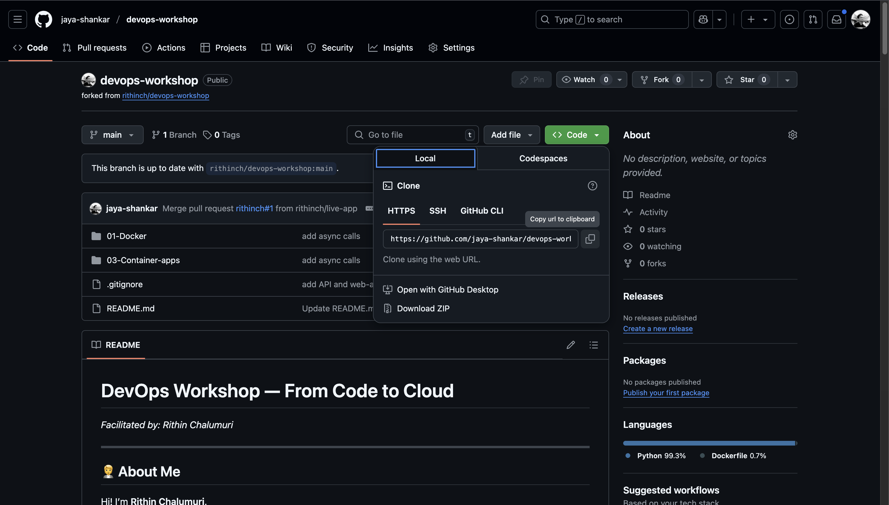
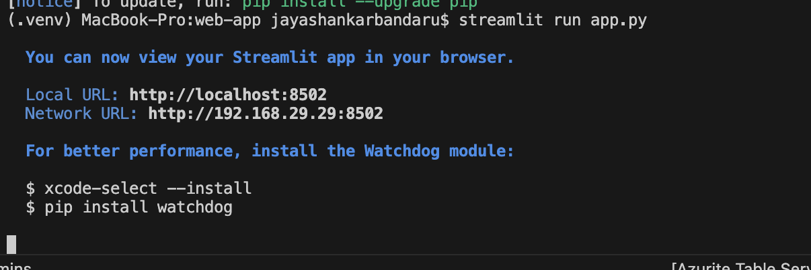
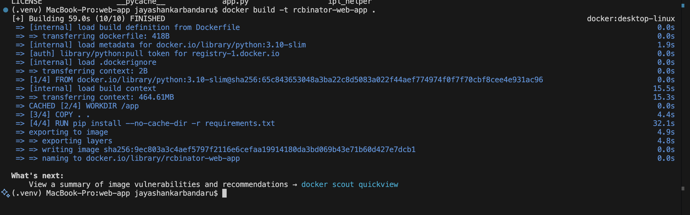
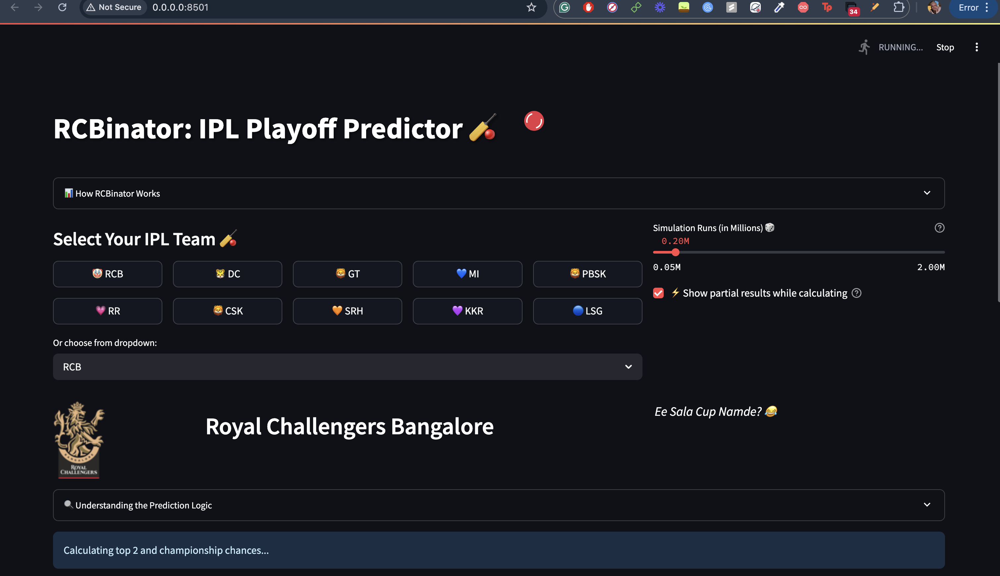

## 📚 Table of Contents

1. [Run Locally](#-run-locally)
2. [Run with Docker](#-run-with-docker)

---

## 🧑‍💻 Run Locally

### 1. Fork the Repository

Fork the main DevOps [repository](https://github.com/sumanth107/devOps) to your GitHub account.


---

### 2. Clone the Repository

Clone the forked repository to your local machine and navigate into the project directory:

```bash
git clone https://github.com/{your-username}/devops-workshop.git
cd devops-workshop
```

> Replace `{your-username}` with your actual GitHub username.



---

### 3. Navigate to the Web App Directory

```bash
cd 01-docker/web-app
```

---

### 4. Create and Activate a Virtual Environment

Create a virtual environment:

```bash
python3 -m venv venv
```

Activate the environment:

- **MacOS/Linux:**
  ```bash
  source venv/bin/activate
  ```
- **Windows:**
  ```bash
  venv\Scripts\activate
  ```


---

### 5. Install Dependencies

Install the required Python packages:

```bash
pip install -r requirements.txt
```

---

### 6. Run the Application

Start the Streamlit app:

```bash
streamlit run app.py
```



---

### 7. Open in Browser

Visit [http://localhost:8501](http://localhost:8501) in your browser to view the running app.


---

## 🐳 Run with Docker

### 1. Navigate to the Web App Directory

```bash
cd 01-docker/web-app
```

---

### 2. Build the Docker Image

Build the Docker image with a tag name:

```bash
docker build -t rcbinator-web-app .
```

- `-t rcbinator-web-app`: Tags the image with a custom name.
- `.`: Uses the current directory as the Docker build context.



---

### 3. Run the Docker Container

```bash
docker run -p 8501:8501 rcbinator-web-app
```

- `-p 8501:8501`: Maps your local port 8501 to the container's port 8501.
- `rcbinator-web-app`: Name of the image to run.


---

### 4. Open in Browser

Visit [http://localhost:8501](http://localhost:8501) in your browser to see the app.


