# 🚀 Deploying the Web App to Azure Container Apps via Azure Container Registry

This guide walks you through deploying your Dockerized web app to **Azure Container Apps** using **Azure Container Registry (ACR)**.

---

## 🛠️ Prerequisites

Ensure you have the following before getting started:

- [Azure CLI](https://learn.microsoft.com/en-us/cli/azure/install-azure-cli) installed and configured.
- Docker installed on your local machine.
- An Azure account with an active subscription.
- Logged into Azure via CLI:  
  [Authenticate with Azure CLI](https://learn.microsoft.com/en-us/cli/azure/authenticate-azure-cli-interactively)

---

## 📦 Step 1: Create Azure Container Registry (ACR)

### 1. Open the Azure Portal

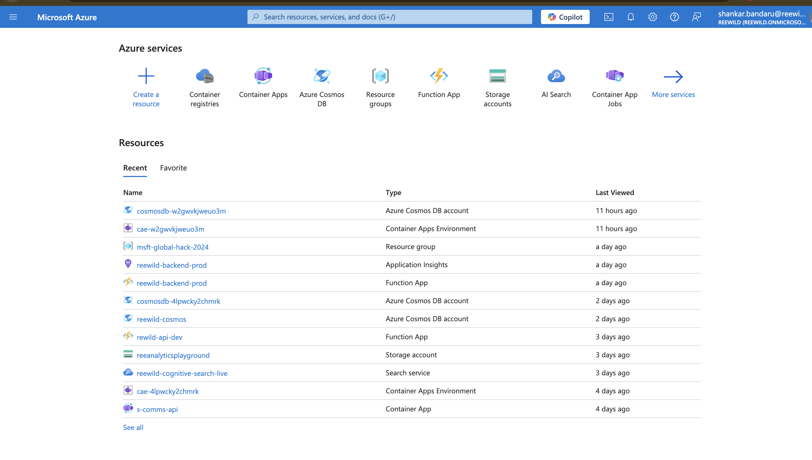

### 2. Create a Container Registry

- Click **"Create a resource"**
- Search for **"Container Registry"**

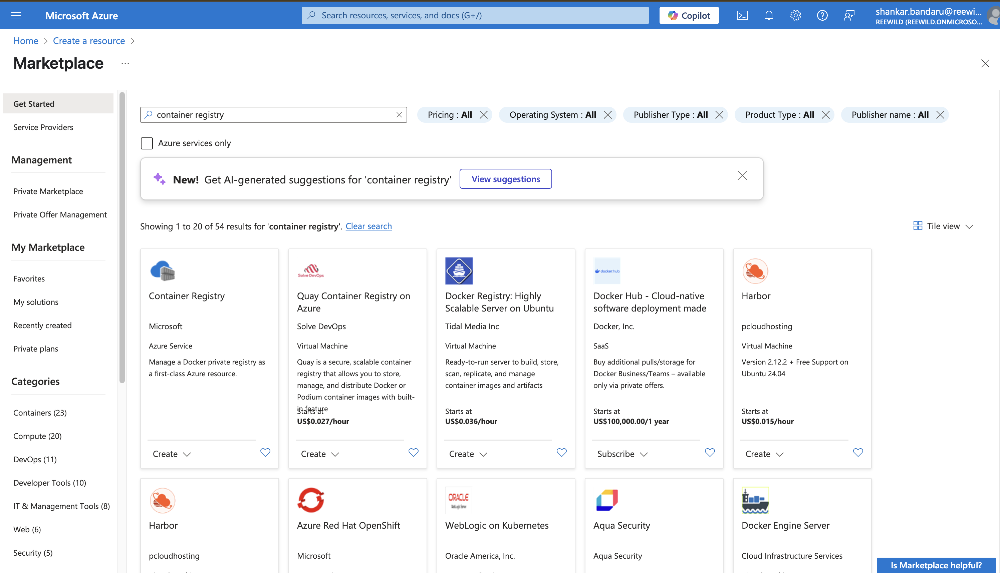

### 3. Click **Create**

### 4. Fill in the registry details:

- **Subscription**: Select your subscription
- **Resource group**: Create or select an existing one
- **Registry name**: Unique name for your ACR
- **Location**: South India
- **SKU**: Basic

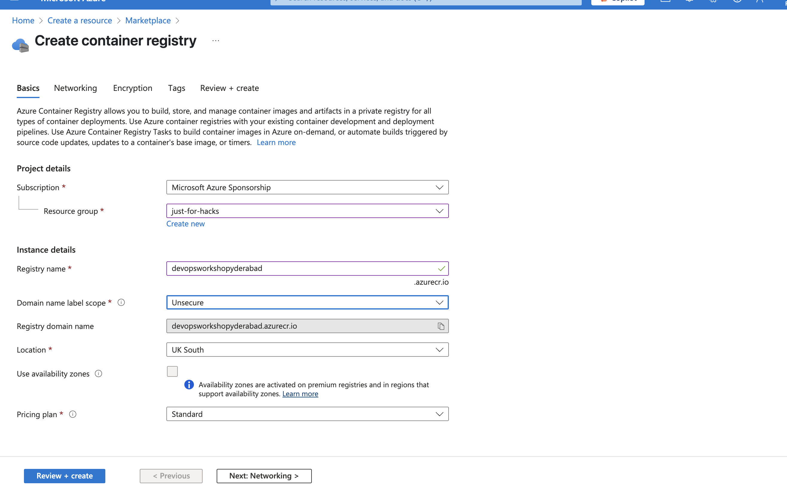

### 5. Click **Review + create**

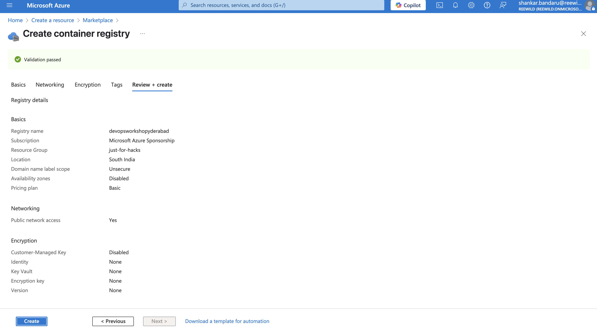

### 6. Click **Create**

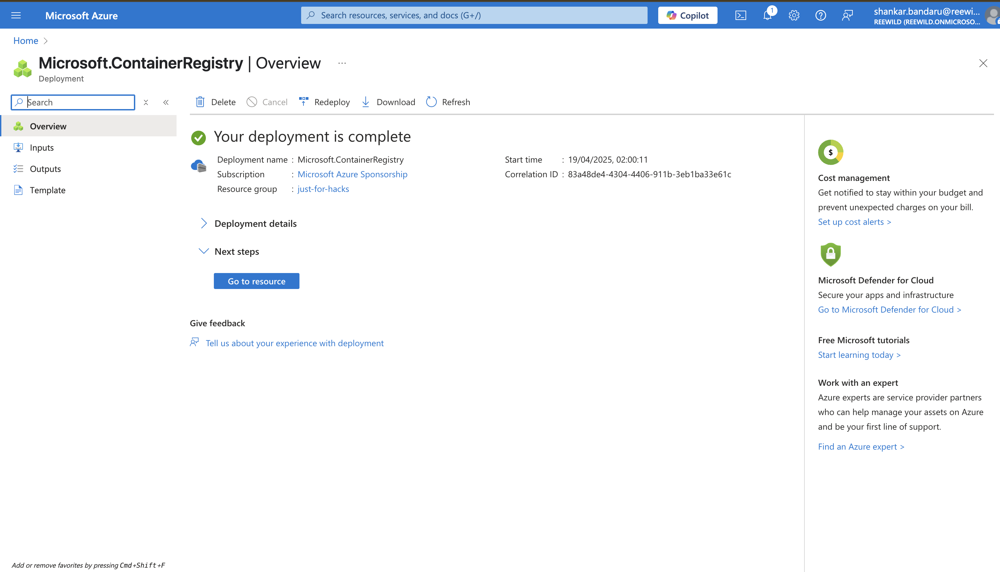

### 7. Go to the Container Registry

Once deployment is complete:

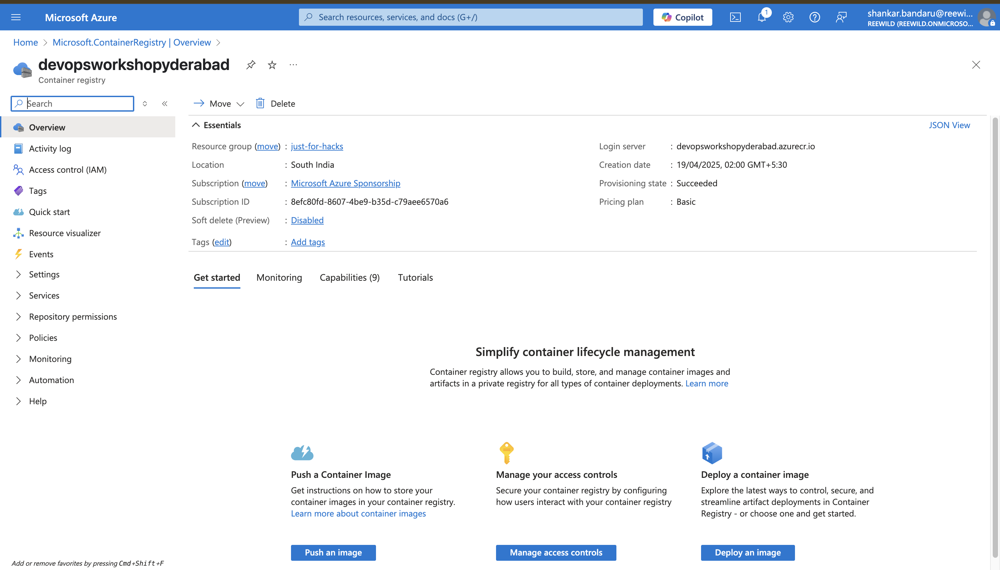

### 8. Access Keys

In the registry, navigate to **"Access keys"** in the left-hand menu:

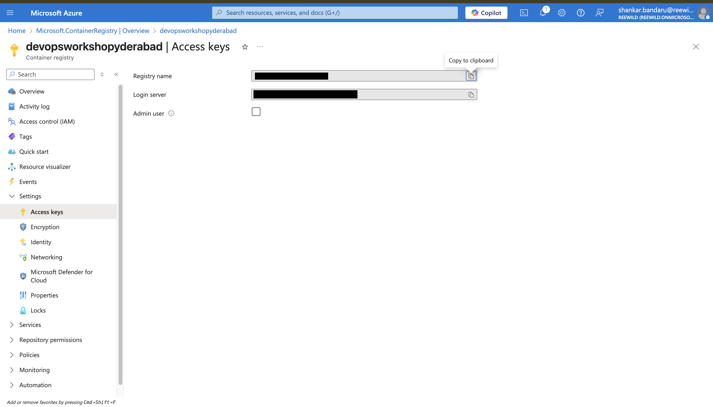

### 9. Note the following:
- **Registry name**
- **Login server**

---

## 🐳 Step 2: Build and Push Docker Image to ACR

### 10. Login to Azure Container Registry

```bash
az acr login --name <your-registry-name>
```

### 11. Build the Docker Image

- Navigate to your project directory where the Dockerfile is located

```bash
cd 01-docker/web-app
```

- Build the Docker image using the following command:

```bash
docker build -t <your-registry-name>.azurecr.io/<your-images/image-name>:<tag> . --platform linux/amd64
```

- Replace `<your-registry-name>`, `<your-images/image-name>`, and `<tag>` accordingly  
  (e.g., `myregistry.azurecr.io/streamlit-app:latest`)

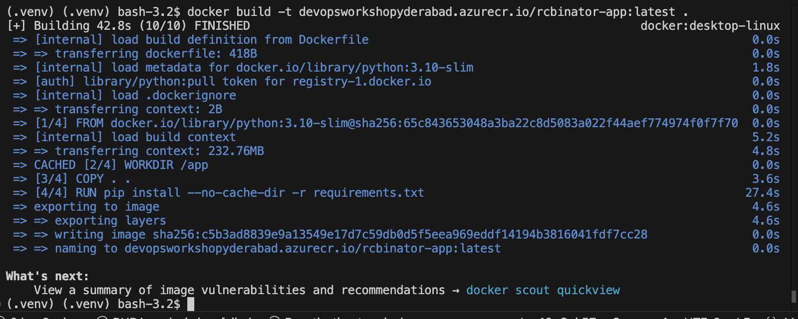

### 12. Push the Image to ACR

```bash
docker push <your-registry-name>.azurecr.io/<your-images/image-name>:<tag>
```

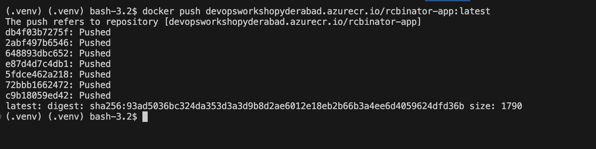

### 13. Verify the Image in ACR

- In the Azure portal, go to your Container Registry
- Navigate to **Repositories**
- You should see your image listed there

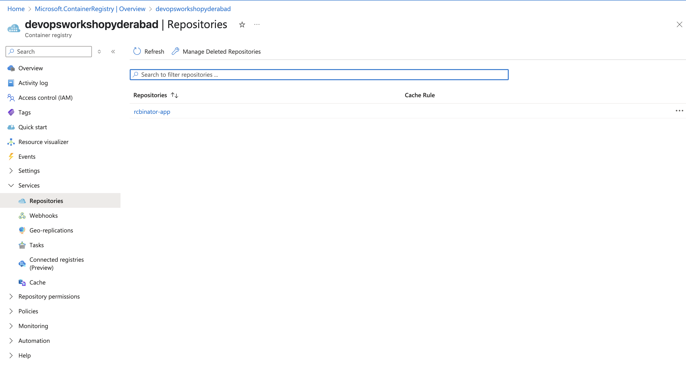

---

## 📲 Step 3: Create a Container App in Azure

### 14. Create a Container App

- Click **"Create a resource"**
- Search for **"Container Apps"**

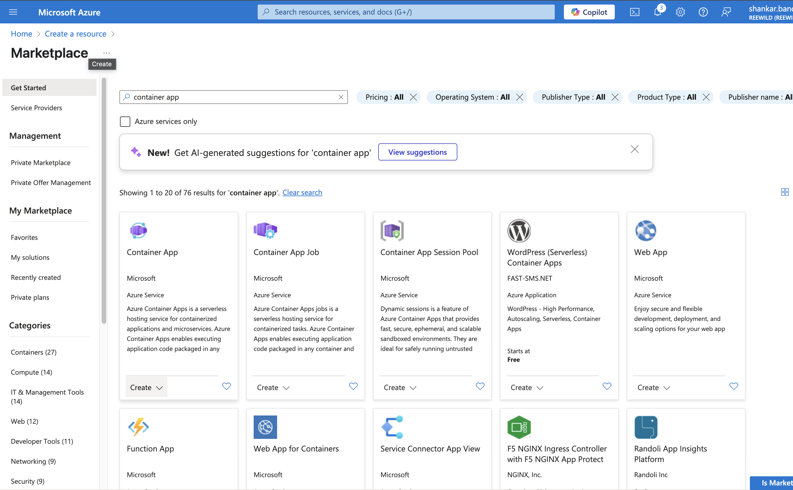

### 15. Click **Create**

### 16. Fill in the app details:

- **Subscription**: Select your subscription
- **Resource group**: Create or choose one
- **App name**: Unique name for your app
- **Region**: South India
- **Environment**: Create or select existing

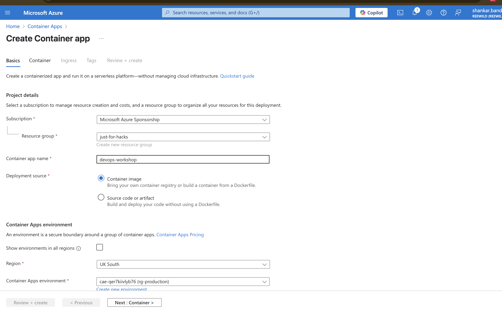

### 17. Configure Container Settings

- Click **Next: Container**
- Choose the image you pushed to ACR

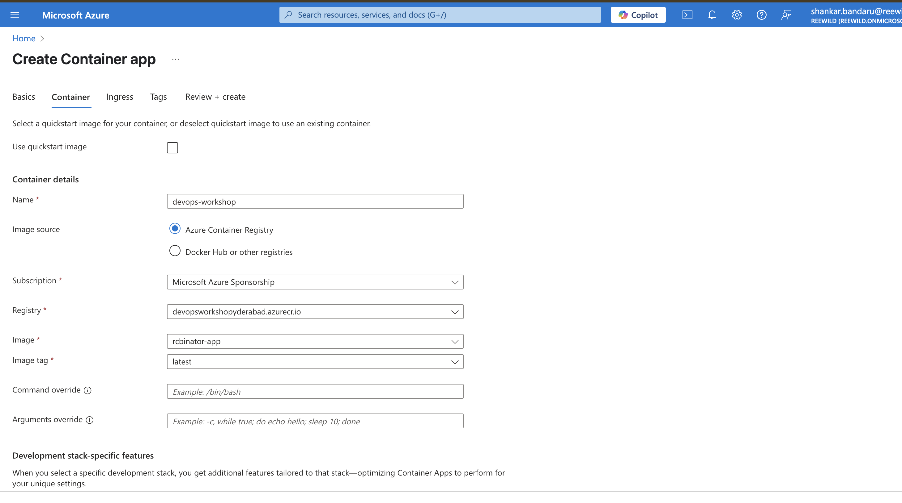

### 18. Configure Ingress

- Click **Next: Ingress**
- Enable ingress
- Set **target port to 8501** (used by Streamlit)

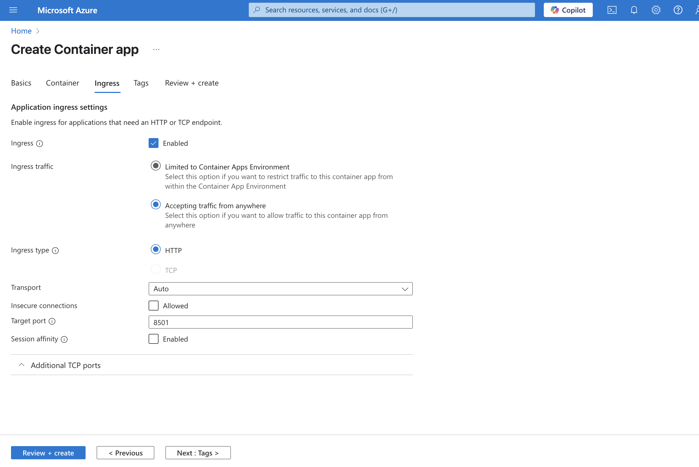

### 19. Review and Create

- Click **Next: Review + create**

### 20. Deploy and Access App

- Once deployed, click **Go to resource**  
  *(deployment may take a few minutes)*

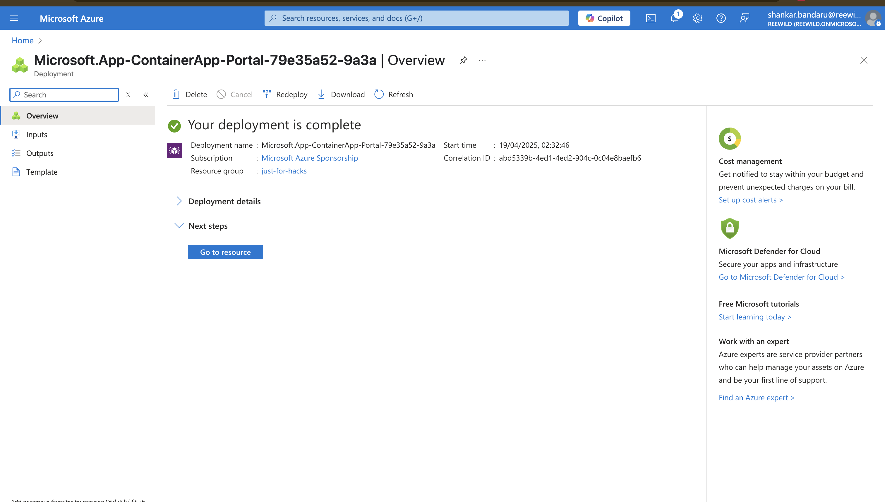

### 21. Go to Resource

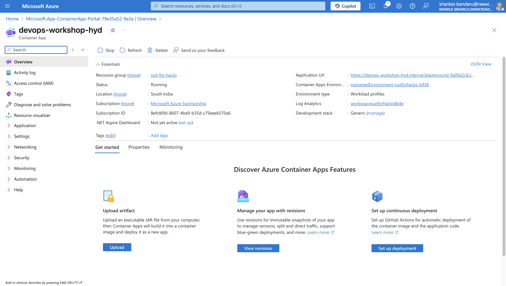

### 22. Find the App URL

- In the left menu, click **Overview**
- Copy the **URL** of your deployed app

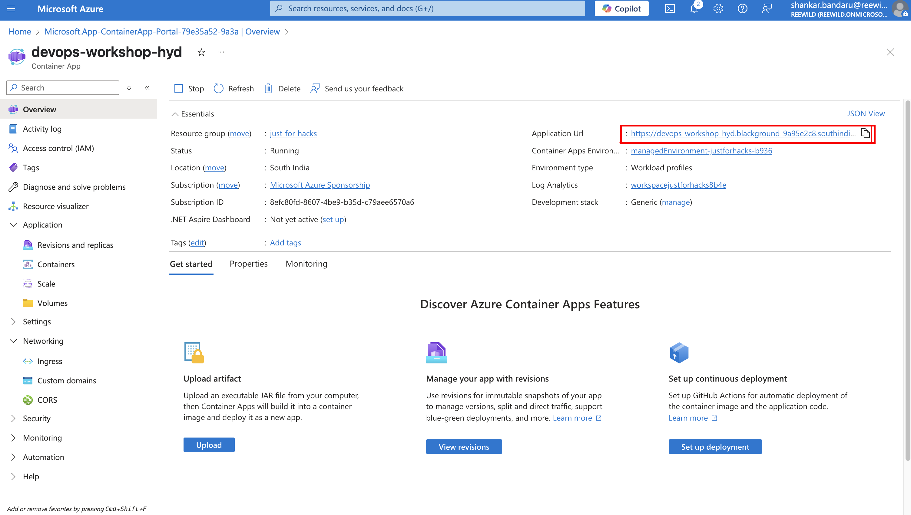

### 23. Open Your Streamlit App

- Open the URL in a new browser tab

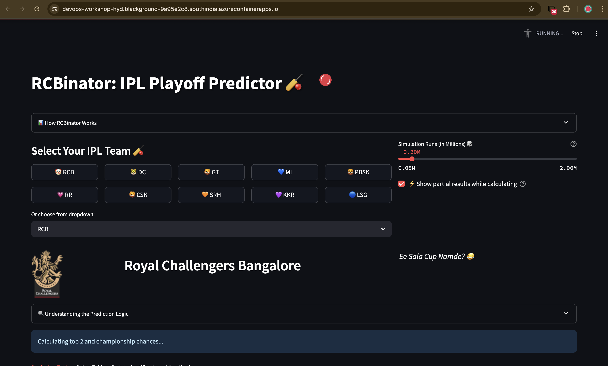

---

## ✅ You're Live!

Your Streamlit app is now successfully deployed using Azure Container Apps via Azure Container Registry 🎉
