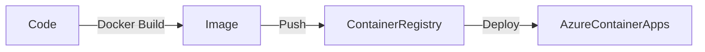
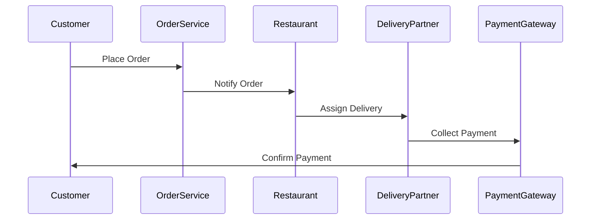

# DevOps Workshop — **From Code to Cloud**
_Facilitated by: Rithin Chalumuri_

---

## 🧑‍💼 About Me

Hi! I’m **Rithin Chalumuri**.

I enjoy building products from 0 to 1, and more importantly, I enjoy helping others build products from 0 to 1.

I've worked across startups and tech projects where I’ve experienced systems growing from a single machine to distributed cloud-scale architectures.

GitHub: [github.com/rithinch](https://github.com/rithinch)

---

## 🕒 Agenda

| Time            | Topic                                      |
|-----------------|--------------------------------------------|
| 9:30 - 10:00    | Pre-requisites & Dev Environment Setup     |
| 10:00 - 10:30   | Introduction to DevOps                     |
| 10:30 - 11:30   | Docker: Containers for Developers          |
| 11:30 - 12:15   | Cloud Deployment & Hosting                 |
| 12:15 - 1:00    | CI/CD with GitHub Actions                  |
| 1:00 - 2:30     | Lunch 🍽️                                   |
| 2:30 - 3:30     | Distributed Systems & Scaling Challenges   |
| 3:30 - 3:40     | Break                                      |
| 3:40 - 4:40     | Infrastructure as Code with .NET Aspire                    |
| 4:40 - 4:50     | Break                                      |
| 4:50 - 5:30     | Observability & Monitoring Fundamentals    |
| 5:30 - 6:00     | Real-world Q&A, Wrap-up                    |

---

## 💡 Session: Introduction to DevOps (10:00 - 10:30)

**Concepts:**
- DevOps = Developers + Operations.
- Not a tool, not a job title, a **culture**.
- Goal: Shorten time from "code complete" to "customer using it".
- Emphasis on collaboration, automation, and reliability.

**Analogy:**
Imagine you're trying to build a LEGO set with friends. Everyone's working on different pieces, but unless you communicate and share instructions, your house will collapse.

**Group Activity:**
Form 2-3 person teams. Each team writes down:
- A problem they've faced when "it worked locally but failed in production".
- What helped resolve it? Share and discuss.

**Learning Resource:**
- [The Phoenix Project](https://itrevolution.com/the-phoenix-project/) (Book)
- [What is DevOps?](https://azure.microsoft.com/en-us/overview/devops/what-is-devops/)

---

## 🐫 Session: Docker & Containers (10:30 - 11:30)

**Why Containers?**
- "It works on my laptop" syndrome is a common pain.
- Containers = Same environment, everywhere.

**Analogy:**
Containers are like lunch boxes. Whether you're in Mumbai or New York, the food inside remains the same. The carrier standardizes transportation.

**Dockerfile Breakdown:**

```Dockerfile
FROM python:3.11-slim      # Base image
WORKDIR /app               # Working directory
COPY . .                   # Copy code into container
RUN pip install -r requirements.txt  # Install dependencies
EXPOSE 8501                # Application port
CMD ["streamlit", "run", "app.py"]   # Start command
```

**Activity:**
- Given a basic Python or Streamlit app, write a Dockerfile.
- Build and run the image locally.
- Modify the `CMD` and `EXPOSE` lines and observe the behavior.

**Learning Resource:**
- [Docker Official Docs](https://docs.docker.com/get-started/)
- [Azure Container Apps](https://learn.microsoft.com/en-us/azure/container-apps/overview)

---

## ☁️ Session: Cloud Deployment & Hosting (11:30 - 12:30)

**Concepts:**
- Cloud = Renting servers, storage, and networking on-demand.
- Azure: Azure Container Apps simplifies container-based deployments.

**Analogy:**
Imagine renting a bike instead of buying one. The cloud allows you to scale your fleet based on demand without owning every piece.

**Mermaid Diagram:**


**Group Exercise:**
- Deploy your container from the previous exercise to Azure Container Apps.

**Learning Resource:**
- [Azure Container Apps Deployment Guide](https://learn.microsoft.com/en-us/azure/container-apps/quickstart-deploy-container)

---

## 🚀 Session: CI/CD with GitHub Actions (12:40 - 1:30)

**Concepts:**
- Automated testing & deployment.
- Reduces manual errors.
- Faster feature shipping.

**GitHub Actions Example:**
```yaml
name: Deploy App

on:
  push:
    branches: [ main ]

jobs:
  deploy:
    runs-on: ubuntu-latest

    steps:
    - name: Checkout Code
      uses: actions/checkout@v4

    - name: Build Docker Image
      run: docker build -t my-app .

    - name: Push to Registry
      run: docker push myregistry.azurecr.io/my-app:latest
```

**Exercise:**
- Create a GitHub Action to build and push your container image to Azure Container Registry.

**Learning Resource:**
- [GitHub Actions Documentation](https://docs.github.com/en/actions)
- [Deploy to Azure with GitHub Actions](https://learn.microsoft.com/en-us/azure/developer/github/github-actions-overview)

---

## 🤔 Session: Distributed Systems & Scaling Challenges (2:30 - 3:30)

**Why Break Down Systems?**
- Independent scaling.
- Easier fault isolation.
- Smaller, manageable codebases.

**Analogy:**
Running one giant program is like having one massive power switch for your house. Microservices give you room-specific switches — isolate and fix issues independently.

**Communication Patterns:**

| Pattern            | Example        | Pros              | Cons                   |
|---------------------|----------------|--------------------|-------------------------|
| Synchronous         | API Call       | Simple             | Tight coupling, latency|
| Asynchronous        | Message Queue  | Decoupled, resilient| More complexity        |

**Real-World Example: UPI**
- Distributed banking nodes.
- Network delays, retries, and eventual consistency.

**Group Activity:**
Design a simple Swiggy-like order flow:
1. Order Service
2. Restaurant Notification
3. Delivery Partner Notification
4. Payment Processing

**Mermaid Diagram:**


**Learning Resource:**
- [Designing Data-Intensive Applications](https://dataintensive.net/)
- [Azure Service Bus](https://learn.microsoft.com/en-us/azure/service-bus-messaging/)

---

## 🔧 Session: Infrastructure as Code (3:40 - 4:40)

**Concepts:**
- Declarative templates for cloud infra.
- Consistent, repeatable deployments.

**Terraform Example:**
```hcl
resource "azurerm_container_group" "app" {
  name                = "my-app-container"
  location            = "East US"
  resource_group_name = "devops-workshop"
  os_type             = "Linux"

  container {
    name   = "app"
    image  = "myregistry.azurecr.io/my-app:latest"
    cpu    = "1"
    memory = "1.5"
    ports {
      port     = 8501
      protocol = "TCP"
    }
  }
}
```

**.NET Aspire Example:**
- .NET Aspire allows you to define local cloud-like environments in code.

**Group Activity:**
- Build an Azure Container Apps deployment using Terraform or .NET Aspire templates.

**Learning Resource:**
- [Terraform Azure Provider](https://registry.terraform.io/providers/hashicorp/azurerm/latest/docs)
- [.NET Aspire](https://devblogs.microsoft.com/dotnet/introducing-dotnet-aspire/)

---

## 🚀 Session: Observability & Monitoring Fundamentals (4:50 - 5:30)

**3 Pillars:**
- Logs: Text-based records.
- Metrics: Quantitative data (e.g., CPU usage).
- Traces: Journey of a request.

**Analogy:**
Monitoring is like a health checkup. Logs = Symptoms, Metrics = Vitals, Traces = Pathology reports.

**Exercise:**
- Emit logs from your containerized app.
- Use Azure Monitor to view logs and traces.

**Learning Resource:**
- [Azure Monitor Overview](https://learn.microsoft.com/en-us/azure/azure-monitor/overview)
- [OpenTelemetry](https://opentelemetry.io/)

---

## 🖊️ Final Wrap-up: The DevOps Loop (5:30 - 6:00)

**Code ➔ Build ➔ Test ➔ Deploy ➔ Monitor ➔ Feedback ➔ Repeat**

- Build with iteration in mind.
- Expect failure, design for recovery.
- Automate everything.
- Focus on team collaboration, not just tools.

**Meme Reference:**
> "My code worked on Friday, what happened over the weekend?"  — *Production on Monday*

---

## 🎉 Thank You!

This workshop was about:

- Understanding core concepts, not just tech stacks.
- Building mental models for modern distributed systems.
- Becoming production-ready.

