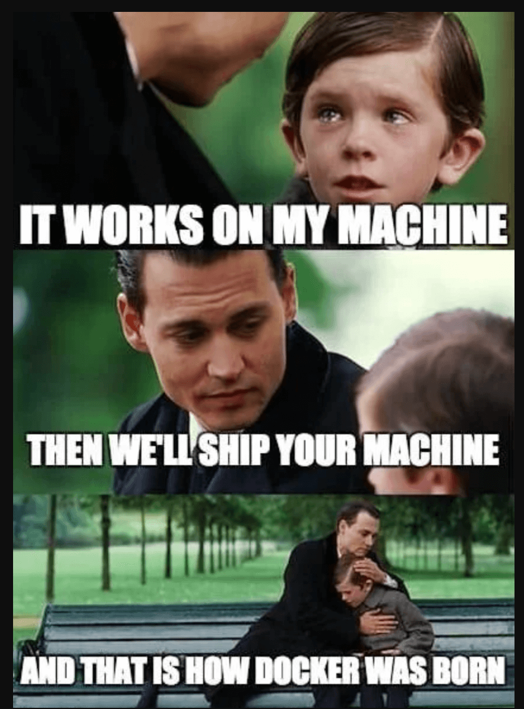
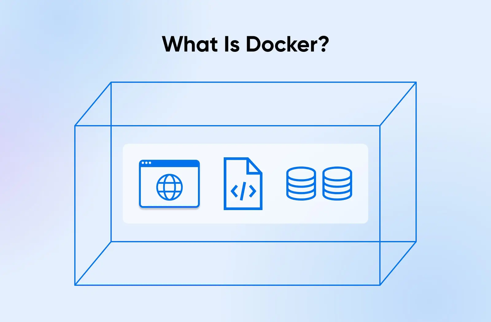
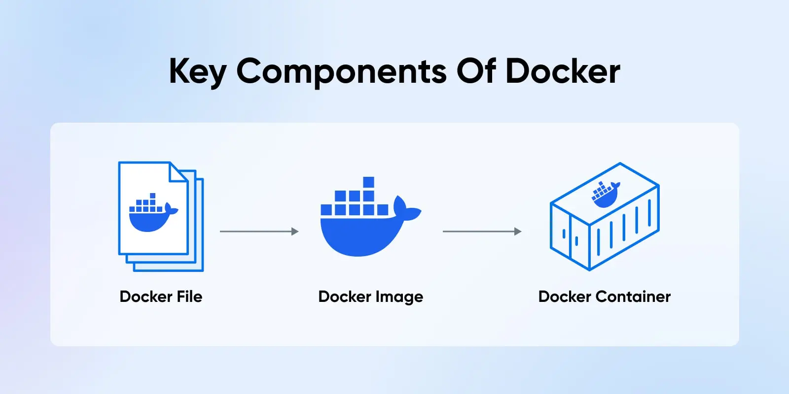
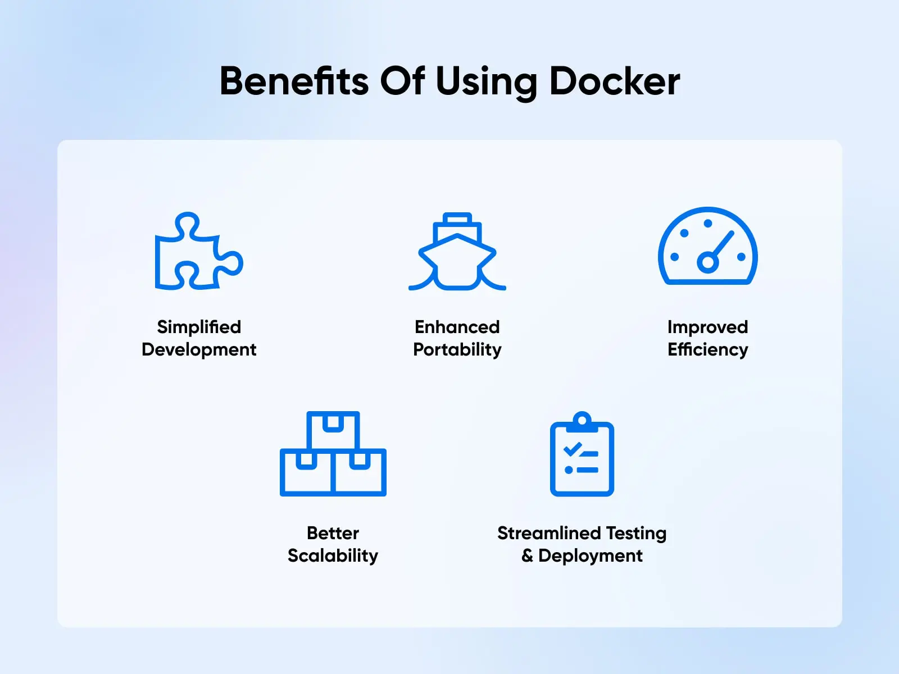
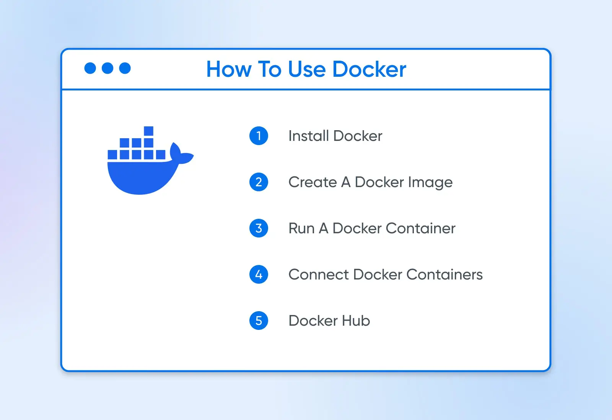
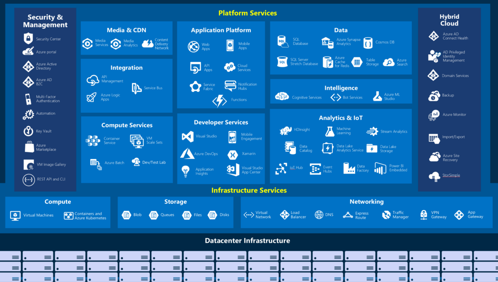
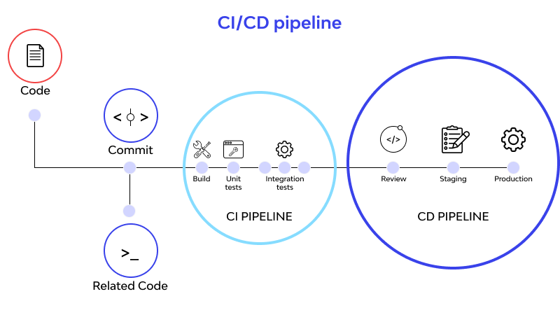
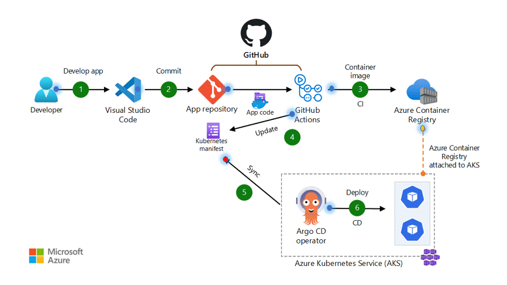
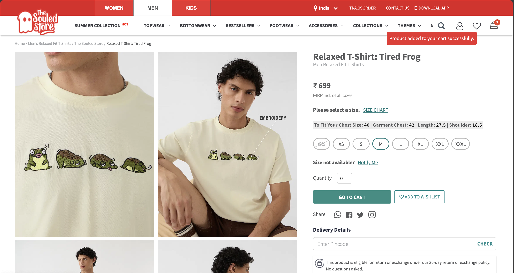
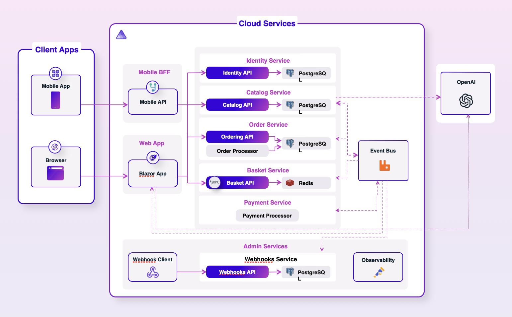

# DevOps Workshop 2025 - Pre-requiresites 🧑‍💻
**From Code to Cloud**   

1.⁠ ⁠*Code Editor*: Preferably [Visual Studio Code](https://code.visualstudio.com/).
2.⁠ ⁠*.NET 9.0*: [Download .NET 9.0](https://dotnet.microsoft.com/en-us/download).
3.⁠ ⁠*.NET Aspire SDK*: Ensure it matches the project's requirements.
4.⁠ ⁠*Docker Desktop*: [Download Docker Desktop](https://www.docker.com/get-started/).
5.⁠ ⁠*Dapr CLI*: Version 1.13.0 or higher. [Install Dapr CLI](https://docs.dapr.io/getting-started/install-dapr-cli/).
6.⁠ ⁠*Azure Developer CLI*: latest [Download](https://learn.microsoft.com/en-us/azure/developer/azure-developer-cli/install-azd?tabs=winget-windows%2Cbrew-mac%2Cscript-linux&pivots=os-mac)
7.⁠ ⁠*Azure CLI*: latest [Download](https://learn.microsoft.com/en-us/cli/azure/install-azure-cli)
8.⁠ ⁠*Azure Functions Core Tools*: latest [Download](https://learn.microsoft.com/en-us/azure/azure-functions/functions-run-local?tabs=macos%2Cisolated-process%2Cnode-v4%2Cpython-v2%2Chttp-trigger%2Ccontainer-apps&pivots=programming-language-javascript#install-the-azure-functions-core-tools)


---


# DevOps Workshop 2025 - Verify Setup 🧑‍💻
**From Code to Cloud**   

⁠```bash
dotnet --version
dapr --version
docker --version
azd version
az --version
func --version
```

```bash
azd login
azd whoami
```

---

# DevOps Workshop 2025 🚀
**From Code to Cloud**   

Rithin Chalumuri 🧑‍💻
Shankar Bandaru 🧑‍💻

---

## 👋 About Me — Rithin Chalumuri

- I enjoy building products from 0 to 1, and helping others do so. 
- Started as a Software Engineer about 7 years ago
- Worked across both startups & enterprise environments, scaling systems from a single server to distributed containers.
- I love working in the intersection of Technology x Social Impact 
- Current: Co-Founder & CTO of Reewild 🌱 (https://www.reewild.com) 

---

## why are we here?

---

## why are we here?


---

- This **isn’t** a "how to code" session.
- This **isn’t** about running apps only on your laptop.

---

This is about:

 👉 **how you put your app into the hands of 1000+ users reliably?**

💡 **how** **developers** **operate**


---

## 🧭 Workshop Agenda

- 💡 Introduction to DevOps 
- 🐋 Docker: Containers for Developers
- ☁️ Cloud Deployment & Hosting
- ⚡ CI/CD with GitHub Actions 
- 🍔 LUNCH (1pm - 2pm)
- 🕸️ Distributed Systems & Scaling Challenges
- 🚀 Infrastructure as Code with .NET Aspire
- 🔭 Observability & Monitoring Fundamentals 
- 🔥 Wrap up + Q&A

---

# 💡 Introduction to DevOps  

---

## DevOps Lifecycle 🧑‍💻

1. Plan  
2. Develop  
3. Build  
4. Test  
5. Release  
6. Deploy  
7. Operate  
8. Monitor  

It’s a continuous feedback loop.


---

## DevOps Lifecycle 🧑‍💻


---

## What is DevOps?

- DevOps = Development + Operations.
- Not just tools — it's about people, processes, and automation.
- Bridges the gap between development speed and deployment stability.
- You build it, you run it (depends)

---

## Why DevOps Matters

- Reduced cycle time from code commit to deployment. (**WHY?** 🙋)
- Encourages early feedback.
- Promotes team collaboration and shared responsibility.

---

## Common Misconceptions

- DevOps ≠ Just CI/CD.
- It’s not limited to tools.
- Success = cultural shift + processes + automation.

---


#

#
#
#
#
#
#
#
#
#
#
#
#
#
# Docker: Containers for Developers  

---

## 🧑‍💻 Hands-on session 🐳

- Clone this github repo: https://github.com/rithinch/devops-workshop
- Step into `01-docker` folder
- How would you run the `web-app`(python streamlit app)? 🤔

---



---

## The Problem

- Inconsistent environments.
- "It worked on my machine!" syndrome.
- Complex dependencies, OS version mismatches.

---

## Docker: The Solution




---

## Docker: The Solution

- Package software + dependencies into isolated containers.
- Consistency from local dev to production.
- Resource efficient and lightweight.

---



---

## Docker Core Concepts

- **Images**: Blueprint for containers. (eg. Apartment floorplan)
- **Containers**: Running instances of images. Think of containers as individual apartments in a high-rise building. Each apartment has its own space, utilities, and resources, but they all share the same building infrastructure.


- **Dockerfile**: Dockerfiles are detailed instructions for creating Docker images.

- **Docker Hub / Registry**: Stores and distributes images.

---



---



---

## Docker Development Lifecycle

1. Write Dockerfile.
2. Build the image.
3. Push image to registry.
4. Pull and run container on target machines.

---

### Docker Basic Commands

- **docker pull**: Pulls the specified Docker image from the Docker Hub
- **docker run**: Runs a container based on a specified image
- **docker build**: Builds a Docker image from a Dockerfile
- **docker ps**: Lists all running containers
- **docker images**: Lists all available Docker images
- **docker stop**: Stops a running container
- **docker rm**: Removes a stopped container
- **docker rmi**: Removes a Docker image

---

## Activity: Containerize an App 🧑‍💻


- Write a Dockerfile for a simple app - IPL Stats 🏏
- Build and run locally.
- Modify `CMD` and observe execution behavior.
  
---

## Learning Resources 


- https://www.dreamhost.com/blog/what-is-docker/
- https://www.docker.com/101-tutorial/
- https://www.youtube.com/watch?v=jPdIRX6q4jA&list=PLy7NrYWoggjwPggqtFsI_zMAwvG0SqYCb

---


# ☁️ Cloud Deployment & Hosting  

---

## Why Cloud?

- Scalability.
- Flexibility.
- Pay-as-you-go model.
- Managed infrastructure = faster feature delivery.

---

## Microsoft Azure



---

## Microsoft Azure Compute Services


---

## Azure Container Apps 


---

## Azure Container Apps

- Serverless (pay for what you use)
- Simplifies deployment of containerized workloads.
- Autoscaling, revision management, built-in traffic splitting.
- Supports microservices and event-driven patterns.

---

## Deployment Flow

1. Build Docker Image.
2. Push to Azure Container Registry.
3. Deploy via Azure Portal, Azure CLI, or GitHub Actions.

---

## Demo - Hands-on Excercise

- Deploy your containerized app to Azure Container Apps.
- Configure scaling policies.
- Test live URL for availability.

---

# ⚡ CI/CD with GitHub Actions  

---

## What is CI/CD?

- **CI**: Automate build & testing after every commit.
- **CD**: Deploy validated code automatically or on approval.
- Purpose: Reduce manual error, ensure consistent delivery.

---




---

## Example Continuous Deployment Flow



---

## GitHub Actions Overview

- Event-driven automation platform.
- YAML-based pipelines.
- Pre-built & custom actions.
- Runners for job execution.

---

## Sample Workflow Structure

- `on:` → Event triggers.
- `jobs:` → Logical unit of work.
- `steps:` → Instructions (checkout, build, deploy).

---

## Activity - Demo

- Create a GitHub Action (via Azure Portal):
  - Build Docker image.
  - Push to Azure Container Registry.
  - Deploy to Azure Container Apps.

---

## LUNCH BREAK 🍟🥤🍔
See you all back in an hour.

---

# 🕸️ Distributed Systems & Scaling Challenges

---


## Real-World Example - Online Store



---

## Activity - Draw Architecture Diagram (10-15 mins)

- Design a distributed system for an online clothes shop like https://www.thesouledstore.com/:
  - Product Catalog, Orders, Basket, Delivery etc. 
- Think about how you'll deploy it with the cloud concepts from the morning session.
  
---

## Real-World Distributed Architecture - Online Store



---

## Why Distributed Systems?

- Handle large scale beyond single machine.
- Fault isolation.
- Horizontal scalability.
- High availability.

---

## Typical Challenges

- Network latency.
- Data consistency.
- Fault tolerance.
- Service discovery & orchestration.

---

## Communication Patterns

- Synchronous: Direct request/response.
- Asynchronous: Queues & Events.
- Each choice affects system latency, throughput, and fault tolerance.


---

# 🏗️ Infrastructure as Code

---

## Why Infrastructure as Code?

- Manual infrastructure = prone to error.
- Reproducibility & version control.
- Declarative desired-state configurations.

---

## .NET ASPIRE Demo

---

## .NET Aspire Overview

- Local developer orchestration of cloud-like environments.
- Helps simulate cloud dependencies in development.
- Simplifies microservice composition.

---

## Group Activity

- Build a .NET Aspire environment locally.

---

# 🔭 Observability & Monitoring Fundamentals  

---

## Why Observability?

- Detect failures early.
- Understand system health.
- Improve recovery times.

---

## The 3 Pillars

1. **Logs**: Event-driven textual records.
2. **Metrics**: Numeric indicators (latency, CPU, etc.).
3. **Traces**: Request journey across services.

---

## Tools in Azure

- Azure Monitor.
- Log Analytics.
- Application Insights.
- Integration with OpenTelemetry.

---

## Activity

- Instrument a simple containerized app.
- Send logs and metrics to Azure Monitor.
- Visualize application health via Azure Dashboard.

---

# 💡 Wrap-Up

---

## DevOps Loop

Code → Build → Test → Deploy → Observe → Iterate

Optimizing this is the loop is key for successful engineering teams.

This is the cycle behind every stable, scalable software product.

---

## Congratulations! 🚀

You’ve now covered basics around:

✅ Docker & Containers
✅ Cloud Deployments
✅ Distributed Systems
✅ Infrastructure as Code
✅ CI/CD Automation
✅ Observability

---

## Questions?

- What was your 'Aha' moment from the workshop?
- Real deployment issues you've seen.
- When to switch from monolith to microservices.
- How to observe and debug distributed systems.

---


# 🙏 Thank You!  

You build it. You run it. You improve it.
That's the DevOps way.


**Rithin Chalumuri**  
GitHub: [github.com/rithinch](https://github.com/rithinch)

**Jaya Shankar Bandaru**  
GitHub: [github.com/rithinch](https://github.com/jaya-shankar)


